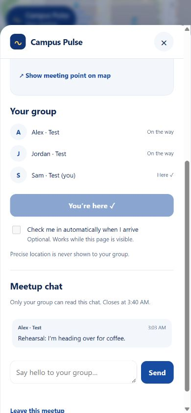
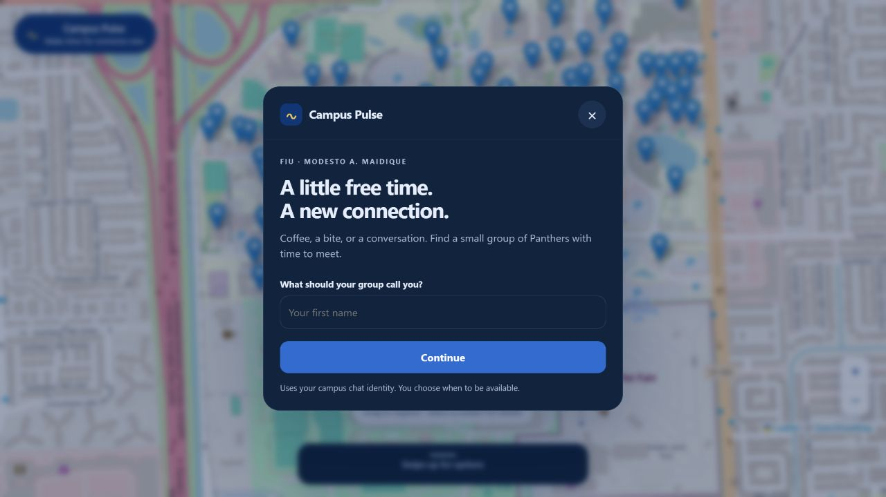

# Pulse interface and rehearsal

## What is connected

`client/mount.js` uses the campus app's existing `firebase.js`, `LiveChat/chatAuth.js`, and Leaflet map. A Campus Pulse button appears on the map and in campus actions. The responsive dialog handles name entry, availability, activity choices, private starting location, waiting, proposals, accept/pass/withdraw, a confirmed meetup, arrival, nested group chat, leaving, and starting a new search.

The campus setup and catalog are read from Firestore before matching is available. A missing or disabled campus shows “Pulse is getting ready.” A cached missing document stays in loading until a server response confirms its status. Opening, signing in, retrying, or reconnecting while idle does not call the Pulse function. Existing active sessions can still refresh/leave when new campus matching is disabled. Genuine connection failures show reconnecting only for an existing session.

Unverified or disabled spots cannot be selected. With no enabled spots, the page explains that meeting spots are being prepared and disables matching and starting-location collection. The three real draft spots remain disabled; the app does not manufacture participants or silently switch to simulated data.

The production entrypoint never imports `preview/main.js`. Preview sessions use the `demo-campus-pulse` project, Auth/Firestore/Functions emulators, and a separate `pulse/rehearsal` campus. Their banner and synthetic point are visibly labeled. Three browser sessions are useful for integration testing, but do not replace three physical phones.

## Local browser rehearsal

Run these from the `Pulse` folder. Start the emulators in one terminal:

```powershell
$env:XDG_CONFIG_HOME = Join-Path (Get-Location) '.local-config'
$env:FIREBASE_EMULATORS_PATH = 'C:\Users\Victor\.cache\firebase\emulators'
node scripts/merge-rules.mjs 'C:\Users\Victor\Desktop\Extra\HackAthon\interactive-map\LiveChat\firestore.rules'
firebase emulators:start --only firestore,auth,functions --project demo-campus-pulse --config firebase.json
```

Then seed one clearly synthetic rehearsal point and start the loopback preview server:

```powershell
$env:FIRESTORE_EMULATOR_HOST = '127.0.0.1:8197'
$env:GCLOUD_PROJECT = 'demo-campus-pulse'
node scripts/seed-emulator.mjs
npm.cmd run preview
```

Open `http://127.0.0.1:8787/preview/index.html?device=1`, and use the Device 2 / Device 3 links in separate tabs. Each device number uses its own named Firebase app and anonymous identity; it stays the same after refresh. Enter test names. Select the same activity and opt in on all three before matching runs (about eight seconds). Accept within the 45-second response window. If two people match before the third opts in, the third continues looking; existing meetups do not accept late additions.

Send a test message, check in manually, view the meeting pin, and reload a tab to confirm recovery. Leaving removes that participant's access. A group with fewer than two remaining people cancels. New searches always start a new availability session. Closing the dialog leaves your current availability or meetup active; use Stop looking / Withdraw / Leave to end it.

The preview server exposes only browser modules, styles, and the rehearsal page. It does not serve Firebase configuration files, backend source, tests, credentials, or directory listings. These loopback URLs are for this computer, not the three phones.

## Location behavior

Starting-location permission is requested only after “Use my current location.” The selected location is read again when availability is submitted so it is fresh. Choosing a listed spot is the manual fallback. The current-position fix is sent privately to the matching backend, never exposed to group members.

Auto arrival is off by default and starts only after a confirmed participant explicitly enables it. Two accurate, recent readings spanning ten seconds must both put the device within the backend's arrival threshold. The browser pauses its watcher while hidden or offline, and stops on leave, account change, expiry, or check-in. Enabling auto arrival does not survive page reload. Manual “I’m here” remains available. The backend stores the result, not a location trail.

GPS indoors, browser location permission, background behavior on actual mobile browsers, and the arrival radius still need a field rehearsal. Phone geolocation needs an appropriate secure context, normally HTTPS; an ordinary Wi-Fi HTTP URL is insufficient. The shown walk duration is an estimate, and Show meeting point centers a pin without claiming route guidance.

## Installation and deployment

The working feature folder is mirrored into the live app at `C:/Users/Victor/Desktop/Extra/HackAthon/interactive-map/Pulse`. Review/install with:

```powershell
node scripts/install.mjs 'C:\Users\Victor\Desktop\Extra\HackAthon\interactive-map'
node scripts/install.mjs 'C:\Users\Victor\Desktop\Extra\HackAthon\interactive-map' --apply
```

The installer copies only versionable feature files, makes minimal `index.html` changes, and adds a narrow `tools/serve_lan.py` allowance for `Pulse/client/*.js`, `Pulse/client/*.css`, and `Pulse/shared/*.js`. Backups of changed application files are under `Pulse/.integration-backup`; it refuses to overwrite independently edited Pulse files. Do further development in the live source after handoff; if syncing this workspace again, review any refused differences instead of forcing an overwrite. Restart an already-running Python server to pick up its new allowlist.

Installation does not deploy Firebase or activate any real meeting spot. Before the judges' demo: verify the three actual waiting points; merge/deploy current Firestore rules and the Pulse functions to the intended project; configure HTTPS hosting with a browser-asset-only output; activate the verified catalog; and rehearse with three physical devices. Use the existing backend deployment handoff for project, rules, cleanup, and Node 22 checks.

## Validation

- Twenty automated tests passed: four matching/validation policies, three browser arrival-watcher tests, twelve Firestore service/rule scenarios, and one real callable/Auth-emulator test.
- Browser UI rehearsal used three independent anonymous accounts: one shared proposal, all three acceptances, a synchronized message, manual check-in, the shared map pin, and reload recovery.
- Leaving/cancellation and Stop looking were retested after fixing the membership-revocation listener transition. Expired unanswered proposals returned to a fresh availability form.
- Desktop and 390 × 844 phone-size layouts were inspected. No horizontal overflow was present at the phone size.
- The installed campus app opened Pulse from its actions menu without browser console errors. HTTP checks returned 200 for browser assets and 404 for Pulse backend, package/configuration, preview, and documentation paths through the campus server.
- Real phone GPS and production deployment have not been tested or performed.
- Startup regression: the production function URL returned HTTP 404 on September 27. The current app now handles the missing campus without attempting that callable or showing a false reconnecting warning. Six new readiness/connection tests pass, and the corrected screen was verified in the existing localhost browser session.




